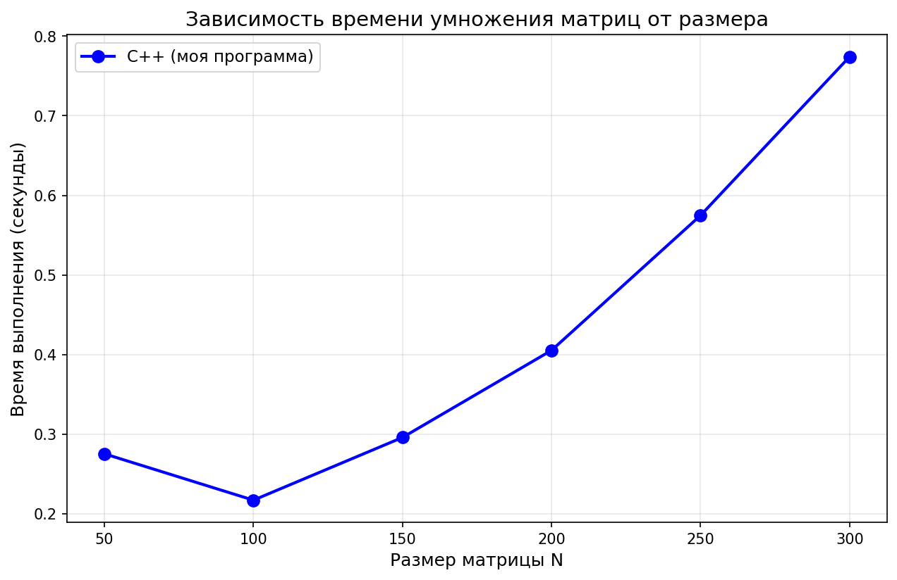

# Matrix Multiplication Lab 1

## Описание
Программа на C++ читает две квадратные матрицы из файлов `matrixA.txt` и `matrixB.txt`, перемножает их, сохраняет результат в `result.txt` и проверяет правильность результатов с помощью Python (NumPy).

## Требования

- Windows  
- Python >= 3.9  
- NumPy (`pip install numpy`)  
- MinGW-w64 (или другой C++ компилятор)  

## Сборка

Открой PowerShell в папке проекта и выполни:
g++ main.cpp matrix.cpp -O2 -o matrix_lab.exe

## Запуск
g++ main.cpp -o mylab.exe
.\mylab.exe
python verify.py

Должны появиться:
- Размер матрицы
- Время выполнения
- Производительность (MFLOPS)
- Верификация результатов

## Верификация:

Программа автоматически вызывает Python-скрипт:
py verify.py matrixA.txt matrixB.txt result.txt

## Входные файлы:

- `matrixA.txt`
- `matrixB.txt`

## Выходной файл:

- `result.txt` — создаётся при запуске

## График производительности

